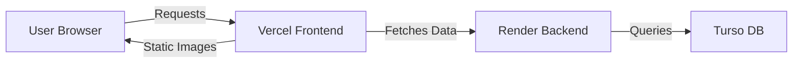

# 🚀 Deployment Guide - Velvet Syndicate

This document provides instructions for deploying the frontend to **Vercel** and the backend to **Render**.

---

## 1. Backend Deployment (Render)

### Pre-deployment Check
1. Ensure the backend builds locally:
   ```bash
   cd backend
   npm run build
   ```
2. The `dist` folder should be generated without errors.

### Render Configuration
1. Create a new **Web Service** on Render.
2. Connect your repository.
3. Set the following:
   - **Root Directory**: `backend`
   - **Build Command**: `npm install && npm run build`
   - **Start Command**: `npm start`
4. Add **Environment Variables**:
   - `NODE_ENV`: `production`
   - `PORT`: `3001` (or your choice)
   - `TURSO_DATABASE_URL`: *Your Turso URL*
   - `TURSO_AUTH_TOKEN`: *Your Turso Auth Token*
   - `JWT_SECRET`: *A secure random string (at least 32 chars)*
   - `FRONTEND_URL`: `https://your-frontend-domain.vercel.app`

---

## 2. Frontend Deployment (Vercel)

### Vercel Configuration
1. Create a new project on Vercel.
2. Connect your repository.
3. Set the following:
   - **Root Directory**: `frontend`
   - **Framework Preset**: `Next.js`
4. Add **Environment Variables**:
   - `NEXT_PUBLIC_API_URL`: `https://your-backend-on-render.com/api`
   - `NEXT_PUBLIC_APP_URL`: `https://your-frontend-domain.vercel.app`

---

## 📦 Important Notes
- **CORS**: Ensure `FRONTEND_URL` in the backend matches the final Vercel domain to avoid CORS errors.
- **Path Aliases**: The backend build process is now verified. Orphaned Next.js files have been removed to ensure `tsc` passes.
- **Images**: Product images are served from the frontend's `/public/real-images` folder. This ensures high availability and fast delivery via Vercel's Edge network.

---

**Architecture Diagram:**

